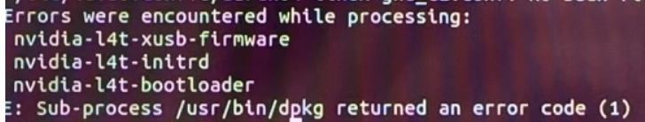
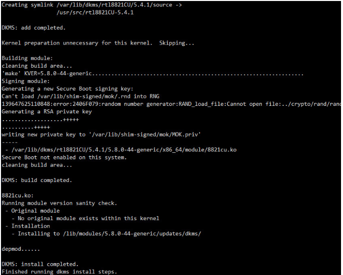
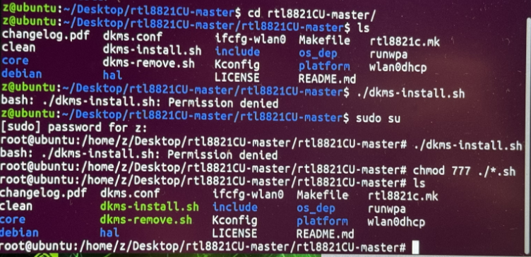
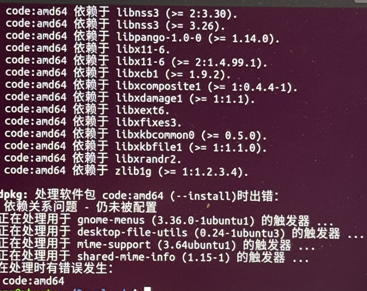

# (一)Jetson Xavier Nx烧录


Ps：使用SDK MANAGER 烧录方式

## 一，Windows安装Ubuntu双系统教程

1. 硬件准备：一个U盘
2. 整理Windows10系统的磁盘，将D盘空间压缩（可用DiskGenius软件）
3. 制作Ubuntu系统启动盘：下载ISO镜像文件，用rufus写入硬盘映像
4. 修改电脑BIOS设置：将安全启动 选项从打开->设置为关闭，启动顺序中，按F5或F6更改顺序，将启动盘的优先级拉高

参考链接：https://blog.csdn.net/fgc346/article/details/108436747

## 二，进入Ubuntu18.04，安装SDK MANAGER

## 三，将产品设置为REC 刷机模式

## 四，烧录完成

## 五，烧录完成后可能会遇到的错误

1. 问题：ubuntu20.04闪了一下就没反应了

错误原因：内存太小无法开机/固态之前可能有系统，需要格式化一下固态

解决方法：格式化固态硬盘，重新刷机

# (二)环境配置

## 一，挂载ssd卡

教程：[Jetson Xavier NX 安装固态硬盘并挂载到/home目录下_nvidia jetson agx xavier固态硬盘挂载到home下-CSDN博客](https://blog.csdn.net/rorypeck/article/details/122636393)

## 二，更新国内源

1. 备份源文件

```bash
sudo cp /etc/apt/sources.list sources_backup.list
```

2. 修改文件

```bash
sudo vim /etc/apt/sources.list
```

3. 删除原有的内容，添加以下：

```
# 默认注释了源码仓库，如有需要可自行取消注释
deb https://mirrors.ustc.edu.cn/ubuntu-ports/ focal main restricted universe multiverse
# deb-src https://mirrors.ustc.edu.cn/ubuntu-ports/ focal main main restricted universe multiverse
deb https://mirrors.ustc.edu.cn/ubuntu-ports/ focal-updates main restricted universe multiverse
# deb-src https://mirrors.ustc.edu.cn/ubuntu-ports/ focal-updates main restricted universe multiverse
deb https://mirrors.ustc.edu.cn/ubuntu-ports/ focal-backports main restricted universe multiverse
# deb-src https://mirrors.ustc.edu.cn/ubuntu-ports/ focal-backports main restricted universe multiverse
deb https://mirrors.ustc.edu.cn/ubuntu-ports/ focal-security main restricted universe multiverse
# deb-src https://mirrors.ustc.edu.cn/ubuntu-ports/ focal-security main restricted universe multiverse
```

3. 更新配置
   sudo apt-get update
   sudo apt-get upgrade

4. 可能会遇到的问题：



解决办法：
sudo mv /var/lib/dpkg/info/ /var/lib/dpkg/info_old/
sudo mkdir /var/lib/dpkg/info/
sudo apt-get update
sudo apt-get -f install
sudo mv /var/lib/dpkg/info/* /var/lib/dpkg/info_old/
sudo rm -rf /var/lib/dpkg/info
sudo mv /var/lib/dpkg/info_old/ /var/lib/dpkg/info/

## 三，安装无线网卡驱动

1. 支持的网卡：RTL8811AU、RTL8811CU、RTL8821AU、RTL8821CU

2. 下载驱动
   github：https://github.com/brektrou/rtl8821CU       直接下载zip源码即可
   本站下载

3. 安装驱动

   + 安装dkms

     sudo su -i        #切换到root用户
     apt-get update    #更新安装源
     apt-get install -y dkms    #安装dkms

   + 安装驱动程序

     unzip rtl8821CU-master.zip    #解压上面下载的驱动
     cd cd rtl8821CU-master
     ./dkms-install.sh             #安装！
     显示如下内容则代表安装成功，拔插网卡查看是否正常工作。



4. 可能会遇到的问题：

   -bash: ./install.sh: Permission denied

   原因：执行的权限不足

   解决方法：```chmod 777 ./*.sh```



## 四，更改为中文（可跳过）

1. 使用如下命令安装 Ubuntu 2204 系统的简体中文语言包：

```
sudo apt install language-pack-zh-hans
```

安装简体中文语言包后会安装两个语言文件，`zh_CN.UTF-8` 和 `zh_SG.UTF-8`，我们使用 `zh_CN.UTF-8`。

2. 更改Ubuntu 2204区域设置为中文

```
sudo update-locale LANG=zh_CN.UTF-8
```

3. 可能会出现的问题：

   unable to locate package

   原因：下载源的设置不对

   解决方法：在下面几个选项中打勾，并选择中国的服务器
   
   

## 五，安装Vs code

1. 可能出现的错误：无法启动

   原因：Jetpack的系统与新版本VSCode不兼容



解决方法：

安装低版本VS Code

2. 安装各种包

# (三)can通信

Python代码：


```python
# linux系统下
result = os.popen("sudo ls -l /dev/ttyUSB0").read()  # 在 jetson nano（ubuntu）及树莓派（raspbian）下控制电机测试，相应的输入连接的串口和波特率
com = result.split()[-1]  # sudo chmod 666 /dev/ttyACM* 有时会报错，显示无曲线打开串口，这时需运行左侧命令
os.system("sudo chmod 777 " + com)
# os.system("sudo fuser -k " + com)
uart = serial.Serial(com, 115200, timeout=0.5)
```

1. 查看串口

   安装CuteCom，CuteCom可以自动读取串口号，基本不用设置，就可以很轻松的读取到串口数据。

2. 查看波特率
   stty -F /dev/ttyS1 -a    #ttyS1为要查看的串口
   sudo stty -F /dev/ttyUSB0 -a

3. **安装ch340驱动**
